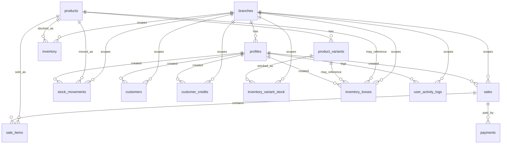

# WebPOS V3 Schema Reference

This document consolidates the database schema currently visible in the repository for `webposv3`.

## Scope

- `Defined in SQL`: table or column is explicitly present in the repository SQL files
- `Inferred from usage`: table or column is referenced by migrations, application code, or backend documentation, but the original base `CREATE TABLE` is not present in this repo

## Source Files

- [database_setup.sql](/C:/Users/FCODES/Desktop/PROJECTS/webposv3/webposv3/database_setup.sql)
- [POSV3_BACKEND_DOCUMENTATION.md](/C:/Users/FCODES/Desktop/PROJECTS/webposv3/webposv3/POSV3_BACKEND_DOCUMENTATION.md)

Legacy SQL migrations were consolidated into database_setup.sql.

## Schema Summary

### Core operational tables

- `public.profiles`
- `public.branches`
- `public.products`
- `public.inventory`
- `public.sales`
- `public.sale_items`
- `public.payments`

### Extended operational tables

- `public.stock_movements`
- `public.saved_carts`
- `public.customer_credits`
- `public.customers`
- `public.product_variants`
- `public.inventory_variant_stock`
- `public.inventory_losses`
- `public.user_activity_logs`
- `public.expenses`

## Relationship Overview

## Tables

### `public.profiles`

Status: `partially defined in SQL`, `base table inferred`

Purpose:
- user metadata for role checks, branch scoping, approvals, and audit attribution

Columns:
- `id uuid` primary key, matches `auth.users.id`
- `full_name text` inferred from trigger insert
- `role text` inferred from trigger insert, used as `admin | cashier`
- `branch_id uuid nullable` inferred from app usage and policies, references `public.branches(id)`
- `is_approved boolean not null default true` defined in [database_setup.sql](/C:/Users/FCODES/Desktop/PROJECTS/webposv3/webposv3/database_setup.sql)
- `created_at timestamp` inferred from app usage

Indexes:
- `profiles_role_is_approved_idx (role, is_approved)`

Notes:
- Created automatically from `auth.users` by `public.on_auth_user_created()`

### `public.branches`

Status: `inferred from usage`

Purpose:
- branch partitioning for operational and RLS scoping

Columns known from app usage:
- `id uuid` primary key
- `name text`

Referenced by:
- `profiles.branch_id`
- `inventory.branch_id`
- `sales.branch_id`
- `stock_movements.branch_id`
- `customers.branch_id`
- `customer_credits.branch_id`
- `inventory_variant_stock.branch_id`
- `inventory_losses.branch_id`
- `user_activity_logs.branch_id`
- `saved_carts.branch_id`

### `public.products`

Status: `partially defined in SQL`, `base table inferred`

Purpose:
- sellable item master records

Columns known:
- `id uuid` primary key inferred
- `name text` inferred from app usage
- `barcode text nullable` inferred and altered/indexed in SQL
- `price numeric` inferred and constrained in SQL
- `cost numeric` inferred and constrained in SQL
- `updated_at timestamp default now()` defined in SQL
- `low_stock_threshold integer not null default 10` defined in SQL

Constraints:
- `products_price_nonnegative CHECK (price >= 0)`
- `products_cost_nonnegative CHECK (cost >= 0)`

Indexes:
- `products_barcode_idx (barcode) WHERE barcode IS NOT NULL`
- `products_barcode_unique_not_null_idx (barcode) WHERE barcode IS NOT NULL` when no duplicate legacy barcodes exist

### `public.inventory`

Status: `partially defined in SQL`, `base table inferred`

Purpose:
- stock per branch and product

Columns known:
- `id uuid` primary key inferred from app usage
- `branch_id uuid` inferred, references `public.branches(id)`
- `product_id uuid` inferred, references `public.products(id)`
- `stock integer` inferred and constrained in SQL
- `min_stock integer not null default 0` defined in SQL

Constraints:
- `inventory_stock_nonnegative CHECK (stock >= 0)`

Indexes:
- unique `inventory_branch_product_unique_idx (branch_id, product_id)`

### `public.sales`

Status: `partially defined in SQL`, `base table inferred`

Purpose:
- sale header / transaction summary

Columns known:
- `id uuid` primary key inferred
- `branch_id uuid` inferred, used by RLS
- `user_id uuid` inferred, used by app and RLS, references `public.profiles(id)`
- `total numeric` inferred and constrained in SQL
- `created_at timestamp` inferred from app usage
- `updated_at timestamp default now()` defined in SQL
- `receipt_no text nullable` defined in SQL
- `status text not null default 'completed'` with values `saved | completed | void`
- `subtotal numeric(12,2) not null default 0`
- `tax numeric(12,2) not null default 0`
- `discount_type text nullable` with values `percent | fixed`
- `discount_value numeric(12,2) not null default 0`
- `discount_amount numeric(12,2) not null default 0`
- `net_total numeric(12,2) not null default 0`
- `notes text nullable`
- `voided_at timestamp nullable`
- `voided_by uuid nullable` references `public.profiles(id)`
- `void_reason text nullable`
- `offline_origin text nullable`
- `local_ref text nullable`
- `unit_cost_total numeric nullable` inferred from app usage

Constraints:
- `sales_total_nonnegative CHECK (total >= 0)`

Indexes:
- unique `sales_receipt_no_unique_idx (receipt_no) WHERE receipt_no IS NOT NULL`
- `sales_branch_created_at_idx (branch_id, created_at DESC)`
- `sales_user_created_at_idx (user_id, created_at DESC)`
- `sales_status_created_at_idx (status, created_at DESC)`
- `sales_local_ref_idx (local_ref) WHERE local_ref IS NOT NULL`

RLS:
- enabled in [database_setup.sql](/C:/Users/FCODES/Desktop/PROJECTS/webposv3/webposv3/database_setup.sql)
- select/insert/update policies scoped to admin or same branch

### `public.sale_items`

Status: `partially defined in SQL`, `base table inferred`

Purpose:
- line items attached to a sale

Columns known:
- `id uuid` primary key inferred
- `sale_id uuid` inferred, references `public.sales(id)`
- `product_id uuid nullable` inferred, references `public.products(id)`
- `quantity integer` inferred and constrained in SQL
- `price numeric` inferred and constrained in SQL
- `created_at timestamp default now()` defined in SQL
- `updated_at timestamp default now()` defined in SQL
- `unit_cost numeric(12,2) nullable`
- `line_subtotal numeric(12,2) not null default 0`
- `discount_amount numeric(12,2) not null default 0`
- `net_line_total numeric(12,2) not null default 0`
- `is_custom boolean not null default false`
- `custom_name text nullable`
- `note text nullable`

Constraints:
- `sale_items_quantity_positive CHECK (quantity > 0)`
- `sale_items_price_nonnegative CHECK (price >= 0)`

Indexes:
- `sale_items_sale_id_idx (sale_id)`
- `sale_items_product_id_idx (product_id)`

RLS:
- enabled with select/insert policies derived from related sale branch access

### `public.payments`

Status: `partially defined in SQL`, `base table inferred`

Purpose:
- payment records for a sale

Columns known:
- `id uuid` primary key inferred
- `sale_id uuid` inferred, references `public.sales(id)`
- `method text` inferred from app usage
- `amount numeric` inferred and constrained in SQL
- `created_at timestamp` inferred
- `updated_at timestamp default now()` defined in SQL
- `reference_no text nullable`
- `status text not null default 'posted'` with values `posted | void`
- `note text nullable`

Constraints:
- `payments_amount_nonnegative CHECK (amount >= 0)`

Indexes:
- `payments_sale_id_idx (sale_id)`
- `payments_method_created_at_idx (method, created_at DESC)`

RLS:
- enabled with select/insert policies derived from related sale branch access

### `public.stock_movements`

Status: `defined in SQL`

Purpose:
- auditable stock history

Columns:
- `id uuid primary key default uuid_generate_v4()`
- `branch_id uuid not null references public.branches(id)`
- `product_id uuid not null references public.products(id)`
- `movement_type text not null`
- `quantity integer not null`
- `unit_cost numeric(12,2) nullable`
- `reference_type text nullable`
- `reference_id uuid nullable`
- `note text nullable`
- `created_by uuid nullable references public.profiles(id)`
- `created_at timestamp without time zone not null default now()`

Constraints:
- `movement_type IN ('sale', 'restock', 'adjustment', 'transfer_in', 'transfer_out', 'void_restore')`
- `quantity > 0`

Indexes:
- `stock_movements_branch_created_at_idx (branch_id, created_at DESC)`
- `stock_movements_product_created_at_idx (product_id, created_at DESC)`

RLS:
- select and insert policies scoped to admin or same branch

### `public.saved_carts`

Status: `defined in SQL`

Purpose:
- stored cart snapshots before checkout

Columns:
- `id uuid primary key default uuid_generate_v4()`
- `branch_id uuid not null references public.branches(id)`
- `user_id uuid not null references public.profiles(id)`
- `customer_name text nullable`
- `cart_name text nullable`
- `subtotal numeric(12,2) not null default 0`
- `discount_type text nullable`
- `discount_value numeric(12,2) not null default 0`
- `discount_amount numeric(12,2) not null default 0`
- `total numeric(12,2) not null default 0`
- `payload jsonb not null default '{}'::jsonb`
- `created_at timestamp without time zone not null default now()`
- `updated_at timestamp without time zone not null default now()`

Constraints:
- `discount_type IN ('percent', 'fixed')`

Indexes:
- `saved_carts_branch_updated_at_idx (branch_id, updated_at DESC)`
- `saved_carts_user_updated_at_idx (user_id, updated_at DESC)`

### `public.customer_credits`

Status: `defined in SQL`

Purpose:
- customer balance tracking with promise-to-pay workflow

Columns:
- `id uuid primary key default uuid_generate_v4()`
- `customer_name text not null`
- `contact_number text nullable`
- `amount numeric(12,2) not null`
- `note text nullable`
- `promise_to_pay_date date nullable`
- `is_paid boolean not null default false`
- `payment_status text not null default 'pending'`
- `branch_id uuid not null references public.branches(id)`
- `created_by uuid not null references public.profiles(id)`
- `created_at timestamp without time zone not null default now()`

Constraints:
- `amount > 0`
- `payment_status IN ('pending', 'paid', 'overdue')`

Indexes:
- `customer_credits_branch_created_at_idx (branch_id, created_at DESC)`
- `customer_credits_customer_name_idx (customer_name)`
- `customer_credits_contact_number_idx (contact_number)`
- `customer_credits_promise_to_pay_date_idx (promise_to_pay_date)`

Trigger logic:
- `public.set_customer_credit_status()`
- `trg_set_customer_credit_status` before insert or update

RLS:
- select scoped to admin or same branch
- insert scoped to `created_by = auth.uid()`
- update scoped to admin or original creator

### `public.customers`

Status: `defined in SQL`

Purpose:
- customer registry separate from credit ledger

Columns:
- `id uuid primary key default uuid_generate_v4()`
- `full_name text not null`
- `contact_number text nullable`
- `email text nullable`
- `address text nullable`
- `notes text nullable`
- `branch_id uuid not null references public.branches(id)`
- `created_by uuid nullable references public.profiles(id)`
- `created_at timestamp without time zone not null default now()`
- `updated_at timestamp without time zone not null default now()`

Indexes:
- `customers_branch_full_name_idx (branch_id, full_name)`
- `customers_contact_number_idx (contact_number)`
- `customers_email_idx (email)`

RLS:
- select/insert/update policies scoped to admin or same branch

### `public.product_variants`

Status: `defined in SQL`

Purpose:
- optional product-level variants

Columns:
- `id uuid primary key default uuid_generate_v4()`
- `product_id uuid not null references public.products(id) on delete cascade`
- `name text not null`
- `sku text nullable`
- `price numeric(12,2) not null default 0`
- `barcode text nullable`
- `created_at timestamp without time zone not null default now()`
- `updated_at timestamp without time zone not null default now()`

Constraints:
- `price >= 0`

Indexes:
- unique `product_variants_unique_name_idx (product_id, name)`
- `product_variants_product_id_idx (product_id)`

### `public.inventory_variant_stock`

Status: `defined in SQL`

Purpose:
- stock counts for variants by branch

Columns:
- `id uuid primary key default uuid_generate_v4()`
- `variant_id uuid not null references public.product_variants(id) on delete cascade`
- `branch_id uuid not null references public.branches(id)`
- `stock integer not null default 0`
- `updated_at timestamp without time zone not null default now()`

Constraints:
- `stock >= 0`

Indexes:
- unique `inventory_variant_stock_unique_idx (variant_id, branch_id)`

### `public.inventory_losses`

Status: `defined in SQL`

Purpose:
- damaged, missing, expired, or adjusted-out stock records

Columns:
- `id uuid primary key default uuid_generate_v4()`
- `branch_id uuid not null references public.branches(id)`
- `product_id uuid nullable references public.products(id)`
- `variant_id uuid nullable references public.product_variants(id)`
- `quantity integer not null`
- `reason text not null`
- `created_by uuid nullable references public.profiles(id)`
- `created_at timestamp without time zone not null default now()`

Constraints:
- `quantity > 0`
- exactly one of `product_id` or `variant_id` must be non-null

Indexes:
- `inventory_losses_branch_created_at_idx (branch_id, created_at DESC)`

### `public.user_activity_logs`

Status: `defined in SQL`

Purpose:
- login/logout audit log

Columns:
- `id uuid primary key default uuid_generate_v4()`
- `user_id uuid not null references public.profiles(id)`
- `branch_id uuid nullable references public.branches(id)`
- `activity_type text not null`
- `created_at timestamp without time zone not null default now()`

Constraints:
- `activity_type IN ('login', 'logout')`

Indexes:
- `user_activity_logs_user_created_at_idx (user_id, created_at DESC)`
- `user_activity_logs_branch_created_at_idx (branch_id, created_at DESC)`

RLS:
- select allowed for admin or same user
- insert requires `user_id = auth.uid()`

### `public.expenses`

Status: `defined in SQL`

Purpose:
- operating expense tracking

Columns:
- `id uuid primary key default gen_random_uuid()`
- `amount numeric(10,2) not null`
- `category expense_category not null default 'Miscellaneous'`
- `description text not null`
- `expense_date date not null default CURRENT_DATE`
- `payment_method varchar(50) not null default 'Cash'`
- `reference_no varchar(100) nullable`
- `created_by uuid nullable references auth.users(id) on delete set null default auth.uid()`
- `created_at timestamptz not null default timezone('utc'::text, now())`
- `updated_at timestamptz not null default timezone('utc'::text, now())`

Constraints:
- `amount >= 0`

Enum:
- `expense_category`
- values: `Utilities`, `Supplier`, `Rent`, `Salaries`, `Marketing`, `Maintenance`, `Spoilage/Loss`, `Miscellaneous`

Indexes:
- `idx_expenses_date (expense_date DESC)`
- `idx_expenses_category (category)`

RLS:
- authenticated read allowed
- authenticated insert requires `auth.uid() = created_by`
- authenticated full management limited to creator

Trigger logic:
- `update_modified_column()`
- `update_expenses_modtime` before update

## Functions and Triggers

### `public.on_auth_user_created()`

Defined in:
- [database_setup.sql](/C:/Users/FCODES/Desktop/PROJECTS/webposv3/webposv3/database_setup.sql)
- replaced in [database_setup.sql](/C:/Users/FCODES/Desktop/PROJECTS/webposv3/webposv3/database_setup.sql)

Behavior:
- inserts a `profiles` row after user creation in `auth.users`
- defaults role to `cashier`
- defaults new signups to unapproved `cashier`

### `public.set_customer_credit_status()`

Defined in:
- [database_setup.sql](/C:/Users/FCODES/Desktop/PROJECTS/webposv3/webposv3/database_setup.sql)

Behavior:
- sets `payment_status` to:
- `paid` when `is_paid = true`
- `overdue` when promise date is before current date
- `pending` otherwise

### `update_modified_column()`

Defined in:
- [database_setup.sql](/C:/Users/FCODES/Desktop/PROJECTS/webposv3/webposv3/database_setup.sql)

Behavior:
- updates `expenses.updated_at` automatically before update

## RLS Coverage

Tables with RLS enabled in repo SQL:
- `public.sales`
- `public.sale_items`
- `public.payments`
- `public.stock_movements`
- `public.customer_credits`
- `public.customers`
- `public.user_activity_logs`
- `public.expenses`

Special note:
- `public.profiles` is protected by RLS in [database_setup.sql](/C:/Users/FCODES/Desktop/PROJECTS/webposv3/webposv3/database_setup.sql)

## Missing Base DDL

The following tables are clearly part of the live schema, but their original `CREATE TABLE` statements are not present in this repository:

- `public.profiles`
- `public.branches`
- `public.products`
- `public.inventory`
- `public.sales`
- `public.sale_items`
- `public.payments`

For those tables, this reference documents only the fields that are directly visible from migrations, application code, and backend documentation.

